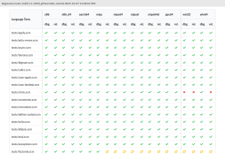

```
                 small,
        `___`       embeddable,
        (o,O)            and
        \)  )          purely
      ---"-"---     functional!
  O t u s   L i s p
```

[](https://github.com/yuriy-chumak/ol/actions/workflows/ubuntu-x86+x64.yml)
[](https://github.com/yuriy-chumak/ol/actions/workflows/ubuntu-aarch64.yml)
[](https://github.com/yuriy-chumak/ol/actions/workflows/cross-mips.yml)
[](https://github.com/yuriy-chumak/ol/actions/workflows/cross-mipsel.yml)
[](https://github.com/yuriy-chumak/ol/actions/workflows/cross-ppc.yml)
[](https://github.com/yuriy-chumak/ol/actions/workflows/cross-ppcle.yml)
[](https://github.com/yuriy-chumak/ol/actions/workflows/macos-intel+m.yml)
[](https://github.com/yuriy-chumak/ol/actions/workflows/cross-win32+64.yml)

<a href="https://iaaa.port0.org/ol/test-matrix/"></a>

Every code change is automatically tested for regressions using github actions and our own test machine.
It includes a set of core language [test suite](tests/), rosettacode [examples](tests/rosettacode/), [ffi tests](tests/ffi), and [language functions reference](doc/reference/README.md) examples.

Github actions results are provided as badges above.  
A test matrix with the results of each test for different platforms is available as a [separate web page](https://iaaa.port0.org/ol/test-matrix/) (github doesn't allow javascript to be included in the readme, so you can follow the link or just click the preview image to open it).

### ✨ Note
* Please see the frequently asked questions and answers in the [Q/A](#qa) section. This may prove important!
* Scheme R<sup>7</sup>RS vs Ol [topic](#r7rs-differences) may be interested too.


<br/>
<a href="https://mastodon.social/@otus_lisp"></a>
<a href="https://twitter.com/otus_lisp"></a>
<a href="https://yuriy-chumak.github.io/ol/"></a>


# OTUS LISP
Otus Lisp (Ol in short) is a purely functional, multi-platform
Lisp dialect with built-in FFI, regular expressions, and infix
math notation support.

Ol implements an extended subset of the R<sup>7</sup>RS Scheme
([PDF](https://small.r7rs.org/attachment/r7rs.pdf)), including
but not limited to some SRFIs. It is tiny (~ 64KB), embeddable,
and cross-platform.  Provides a portable, high-level interface
to call code written in another language (C, Python, Lua, etc).
You can call native OS functions directly from your Ol program.

You can use Ol on Linux, Windows, macOS, Android, Chromebook*,
(Open/Free/Net) BSD, Solaris and other operating systems based
on various hardware architectures (x86, arm, ppc, mips, etc.),
and directly in the web browsers (in WebAssembly form).

* 64KB is a typical size of the Otus Lisp Virtual Machine (olvm) binary and may vary across platforms.  
  Olvm can run compiled Ol code standalone or in embedded form.
* The typical size of Ol with FFI and Compiler is 480KB (less than a megabyte. cool, huh?).

### credits to
Aki Helin (author of [Owl Lisp](https://gitlab.com/owl-lisp/owl), the project that gave birth to Otus Lisp),  
[the-man-with-a-golden-mind](https://github.com/the-man-with-a-golden-mind) (for ideas, usage, and lot of tests),
[nullscm](https://github.com/nullscm) (for usage and tests),
Odysseus (for tests, ideas, and math corrections),
mt (for tests and ideas).

### additional readings
* [Ol Language Reference](doc/reference/README.md)
* [Ol vs R<sup>7</sup>RS](doc/R7RS-DIFFERENCES.md)
* [FFI for Advanced Devs](extensions/FFI.md)
* [Ol Infix Math](doc/reference/infix-notation.md)
* [CHANGELOG](doc/CHANGELOG.md)

Join the online [gitter.im chat](https://gitter.im/otus-lisp/Lobby).
Alternatively the Libera.Chat [#otus-lisp](https://web.libera.chat/#otus-lisp) (alternate [lightweight](https://web.libera.chat/gamja/#otus-lisp) web-client) channel is available.
[The Issues](https://github.com/yuriy-chumak/ol/issues) github page waiting for your bug reports and issues.

# VERSIONS
Current version is **[2.6](tree/2.6)**.  
Version **2.7** is in beta state. It is planned for release by the beginning of this (2026) year.  
<sub><sup>
I'm really sorry for the delay. But maintaining the project amid the blackouts caused by the aggressive, fascist russian regime is a bit challenging. :(
</sup></sub>


# PACKAGING
[](https://repology.org/project/ol/versions)
[](https://repology.org/project/ol/versions)
[](https://repology.org/project/ol/versions)

* Ubuntu (and it's descendants such as Mint, Pop!_OS, Xubuntu, etc.) users may use the official [project ppa](https://launchpad.net/~yuriy-chumak/+archive/ubuntu/ol) as:
  ```shell
  $ sudo add-apt-repository ppa:yuriy-chumak/ol
  $ sudo apt update
  $ sudo apt install ol
  ```

* ~~**CentOS**, **Debian**, **openSUSE**, **RHEL**, **SL**, **SLE**, **Ubuntu**, **Univention** precompiled packages: [OpenSUSE Build Service](https://software.opensuse.org/download.html?project=home%3Ayuriy-chumak&package=ol).~~

Some additional libraries can be installed using 'kiss' package manager. Instructions available at [**ol-packages** repository](https://github.com/yuriy-chumak/ol-packages).


# Q/A

* Otus Lisp
   1. Q. Why doesn't the Ol command line handle **arrow keys** and history?  
      A. For the gods of simplicity. Use an external tool to such behaviour. I recommend to use an [rlwrap](https://github.com/hanslub42/rlwrap) tool  
         (run as `rlwrap ol` in terminal, or add an `alias ol="rlwrap /usr/bin/env ol"` line to your *~/.bashrc* and then run as just `ol`).

   1. Q. Why when I enter 1.23 I get **123/100** and not 1.23?  
      A. Because Ol was designed to behave identically across all supported platforms.  
         Floating-point math varies across platforms, so Ol uses exact numbers by default. If you want to use real floating-point numbers, enter `#i1.23` or `(inexact 1.23)`.

   1. Q. Do you have something like a "**hibernate mode**"?  
      A. You can save yours current session with `,save "filename-you-want"` and exit Ol.
         Then, simply run Ol as `ol filename-you-want` any time later to continue the saved session.

* Source code
   1. Q. Some folders **are empty** (i.e. "libraries/OpenGL"), is it ok?  
      A. Yes, it's ok. Some parts of Ol project are separated into their own independent repositories.  
         Use `git clone --recursive` to get a full project. Or `git submodule init; git submodule update` to update existing one.

   1. Q. *.. **fatal error**: stdlib.h: No such file or directory.*  
      Q. *.. **fatal error**: bits/libc-header-start.h: No such file or directory.*  
      A. Install gcc `multilib`, i.e.
         * `apt install gcc-multilib` for debian-based,
         * `apk add musl-dev` for alpine-based,
         * etc.

   1. Q. */usr/include/linux/errno.h:1:10: fatal error: asm/errno.h: No such file or directory*  
      A. Install `linux-libc-dev:i386`

   1. Q. You reference to licenses **MIT and LGPL**. Can I freely choose between these two licenses?  
      A. Yes, you are free to choose an MIT or LGPL license.

* Extras
   1. Q. I want to run Ol in **a venv** (Virtual ENVironment). Can I?  
      A. Yes. Use `--home=yours-venv-folder` command line option ([more about](#virtual-env) venv).  
         Additionally, you can embed such a venv into the Ol executable itself (the [portable](#portable-form) form).

   1. Q. Why do you call the characters not "characters" but "**runes**"?  
      A. Because they are *runes* - universal naming for letters for a wide set of alphabets.

   1. Q. Anything else interesting?  
      A. Yes, Ol provides **simplest HTTP web-server** for sharing a local folder over an inter/intra-net.  
         Just type `echo ,load http/server| ol` in command line (or `,l http/server` inside Ol session),  
         change `ol` to `ol - --port 8080` to use the custom port.

   1. Q. I'm lost in prefix math notation, can you help me?  
      A. Ol has a special math library that provides **infix math** notation. Use the `(math infix-notation)` library.  
      ```scheme
      > (import (math infix-notation))
      > (print (infix-notation
         1 + 2 * 3 - sqrt(4)
      ))
      5

      ; '\\' is a short for infix-notation
      > (print (\\  1 + 2 * 3 - sqrt(4) ))
      5

      ; you can review result of transformations with ",expand"
      > ,expand (\\  1 + 2 * 3 - sqrt(4) )
      (- (+ 1 (* 2 3)) (sqrt 4))
      ```


Breaking changes (master branch), as part of Ol 2.7 preparation
===============================================================
The following breaking changes have been added to the master branch as part of 2.7 version preparation:
* ❗ internal type names are changed (type codes are NOT changed).  
  please, don't use internal type names in your code, use predicates instead
  * `type-string-displatch` type name changed to `type-superstring` (the old name caused confusing)️
    * you shoud use `string?` predicate to check the string,
    * if you want to use older name, add `(define type-string-displatch type-superstring)` as compat layer
  * `type-enum+` changed to `type-value+` (accent on integer as a value)
  * `type-enum-` changed to `type-value-` (same)
  * `type-int+` changed to `type-integer+` (the fewer name trancations, the better)
  * `type-int-` changed to `type-integer-` (same)
* ❗ `values` with an empty argument list now returns *#false* instead of the string "no vals"
* ❗ `sqlite:value` no longer returns the result of *sqlite3_changes()*
  but simply *#false* if nothing was returned
  * use the "RETURNING" statement with INSERT and UPDATE if you want to return something.
* ❗ Welcome invitation changed
* ❗ `procedure?` made r7rs compatible (will now return *#false* for ff's)
* ❗ arity errors changed (made more clear and descriptive)


R<sup>7</sup>RS DIFFERENCES
===========================

Full differences list can be found in the [doc/R7RS-DIFFERENCES.md](doc/R7RS-DIFFERENCES.md).

The most important differences are:

* Ol is definitely **case sensitive**.
* Numbers WITHOUT PRECISION considered to be **exact** in Ol, but *inexact* in Scheme.
  - `integer?` for inexact numbers always returns **#false** in Ol.
  - note: Use `inexact` function to convert number into inexact form, or prefix number with `#i` directly (like `#i0.123` for inexact 0.123).
* **No** `set!` in Ol (Ol is a purely functional!),
  - note: Use `define`, `define-values`, `let`, `let*`, `letrec`, and `letrec*` instead.
  - note: Limited support of `set-car!`, `set-cdr!`, and `set-ref!` functions [are provided](doc/reference/pairs-and-lists.md#set-car), but is not recommended to be used.
  - note: Inexact numbers can be changed with `vm:set!`, but is not recommended to be used.
  - note: Dynamic variables are available via `(scheme dynamic-bindings)` [library](doc/reference/dynamic-bindings.md).
* CHARACTERS in Ol are **small numbers** (aka 'value+'), but special *character* type in Scheme.
  - note: Ol supports the full Unicode 15.0.0 (2022 Sep 13) character set.
  - note: To write a character use `write-char`, otherwise you'll write a number.
* `apply` arguments count is **limited to 249** in Ol (but `list` elements count is unlimited, sure).
* NEGATIVE indices in `substring` are **valid** in Ol (means "from the end of string", -1 means a last *rune*).
* NEGATIVE vector indices are **valid** in Ol (means "from the end of vector", -1 means a last element).
* Ol has **extended form** of `case` (with vectors support),
* Ol has **extended form** of `if` (with `then` and `else` [keywords](doc/reference/)),
* Ol has **builtin dictionary** numeric and symbolic keys (the [reference](doc/reference/ffs.md) page),
* Ol has builtin **regular expressions** (the [reference](doc/reference/regex.md) page),
* Ol has builtin **infix notation** (the [reference](doc/reference/infix-notation.md) page),
* Ol has an awfully **powerful macro system** in addition to Scheme's hygienic one (a brief [notes and examples](doc/reference/macros.md)).

### Supported SRFI
* srfi-0 - `cond-expand`, builtin
* srfi-16 - `case-lambda`, builtin
* srfi-71 - `(let* ((a b (values..`, builtin
* srfi-87 - `<=` in `case`, builtin


BUILD / RUN / INSTALL
=====================

#### BUILD REQUIREMENTS

* GCC 3.2+ / CLANG 3.5+
* GNU MAKE

Type `make help` (gmake for *BSD) to see a list of available targets.

#### BUILD

```
$ make
```
Advanced build instructions: [doc/BUILD.md](doc/BUILD.md)


#### RUN
```
$ ./ol
Welcome to Otus Lisp 2.6
type ',help' to help, ',quit' to end session.
> 
```

The Ol binary includes a rich set of features (lists, vectors and bytevectors, ansi and unicode strings, infinite precision math, associative arrays aka "ff"s, i/o streams, lazy evaluations, regular expressions, continuations, exceptions, lexer parsers, async functions and actors, etc.) and can be used as a completely standalone.


#### INSTALL
```
$ sudo make install
```

Note: by default we use */usr/bin/ol* for Ol binary, and */usr/lib/ol/* folder for Ol libraries.


#### UNINSTALL
```
$ sudo make uninstall
```


LEARNING
========

The Otus Lisp language is based on [Scheme R<sup>7</sup>RS](https://small.r7rs.org/) ([PDF](https://small.r7rs.org/attachment/r7rs.pdf)) with minor changes and useful extensions.

You can find working Ol examples at:
* [Standard procedures](doc/reference/) list (constantly improving),
* [RosettaCode](http://rosettacode.org/wiki/Category:Ol) Ol page,
* [Tests](tests/) and [Examples](examples/) repository folders,
* Android example code available at [android](examples/android/) folder.


Additionally,
* "LogicWire" and "Digital rain" examples demonstrates native libraries direct usage (the [OpenGL](http://www.opengl.org/)):
  * https://github.com/yuriy-chumak/ol/tree/master/examples/LogicWire ([idea source](https://realhet.wordpress.com/2015/09/02/bitmap-logic-simulator/))
    
  * https://github.com/yuriy-chumak/ol/tree/master/examples/Matrix
    

* "Pacman" sample demonstrates embedding Ol scripts in native "C" code - https://github.com/yuriy-chumak/ol/tree/master/examples/pacman  
  

* "Newton dynamics" sample demonstrates extended native libraries usage (the [newton-dynamics](http://newtondynamics.com), physical simulation engine) with callbacks (C to Lisp automatic translation) - https://github.com/yuriy-chumak/ol/tree/master/examples/Newton.
You should have compiled [newton-dynamics.so](https://github.com/MADEAPPS/newton-dynamics) core library.  
  


DEPRECATIONS
------------

* 2.6 -> 2.7 (which is planned, but i'm not sure about)
  - i'm thinking about changing `(wait ms)` to `(wait s)`, it means the seconds usage instead of milliseconds.

* 2.5 -> 2.6
  - feature `ol-2.5` changed to `ol-2.6`.
  - removed deprecated libraries `(scheme srfi-Nnn)`, use `(srfi Nnn)` instead,
  - i/o scheduler enabled by default for reads,
  - `write` function made r7rs-compliant,
  - `(owl format)` moved to `(otus format)`.

* 2.4 -> 2.5
  - feature `ol-2.4` changed to `ol-2.5`.
  - `(system args port...)` changed to `(execvp args port...)`. New `(system command)` introduced.
  - `(OpenGL version-X.Y)` libraries changed to `(OpenGL X.Y)`.
  - `fft-size-t` changed to `fft-size_t`.
  - `HAS_...` build variables changed to convenient `HAVE_...`.

* 2.3 -> 2.4
  - `(ilist ...)` is deprecated. Use `(cons* ...)` instead.
  - `(interact ...)` from (owl ~~interop~~ async) is deprecated. Use `(await (mail ...))` instead.
  - `(fork ...)`, `(fork-named ...)`, `(fork-server ...)` is deprecated. Use `(async ...)`, `(async 'name ...)`, `(actor ...)` instead.


FFI
---

Using external "asin" function instead of built-in one:
```scheme
; import ffi library
> (import (otus ffi))

; load binary shared module (so or dll)
> (define LIBM (load-dynamic-library "libm.so.6"))

; declare external function prototype
> (define asin (LIBM fft-double "asin" fft-double))

; use the external function
> (print (asin 0.5))
0.523598775
```

Windows UI example:
```scheme
> (import (otus ffi))
> (define USER32 (load-dynamic-library "user32"))
> (define MessageBox (USER32 fft-int "MessageBoxA" type-vptr type-string type-string fft-int))

; use the external function
> (MessageBox #f "hello world" "message box" 1)
1  ; 2 if you clicked "Cancel"
```

HACKING
-------

Ol contains built-in tool for inspecting the Otus Lisp language.

You can use the REPL `,expand` command to expand high-level Ol instructions into low-level (core) Otus Lisp.
```scheme
> ,expand (assert (+ 1 2) = 3)
'(ifeq (equal? ((lambda (g1) g1) (+ 1 2)) 3) #true #true (runtime-error "assertion error:" (cons (quote (+ 1 2)) (cons "must be" (cons (quote 3) '())))))
```

You can use the REPL `,disassembly` (or `,dis`, or `,d`) command to disassemble Otus Lisp functions to the Ol virtual machine instructions.
```scheme
> ,dis (lambda () 1)
type: bytecode
code: (11 1 0 5 14 1 4 24 4 17)
disassembly '(length command . args):
(4 BNA 1 0 5)
(3 LD 1 4)
(2 RET 4)
(1 ARITY-ERROR)

> ,dis (lambda (x y) (+ x y))
type: procedure
code: #((11 3 0 7 1 1 2 6 2 6 3 17) #<+>)
disassembly '(length command . args):
(4 BNA 3 0 7)
(4 REFI 1 2 6)
(3 GOTO 6 3)
(1 ARITY-ERROR)
```

RUNNING
-------

You can use basic Ol functionality without any installation - just copy the `ol` (`ol.exe` for Windows) binary to any user-accessible path.

Basic functionality includes a rich set of features: lists, vectors and bytevectors, numbers math with unlimited accuracy, strings, associative arrays (named `ff`), i/o streams and files, lazy calculations, regular expressions, asyncs and actors, etc.

Advanced functionality (i.e. OpenGL support) requires a complete installation of the Ol package:
  * You can use precompiled binaries and/or installation packages that can be found at the [Releases](https://github.com/yuriy-chumak/ol/releases) announcement page.
  * or You can manually copy required [libraries](https://github.com/yuriy-chumak/ol/tree/master/libraries) to your OL_HOME or current directory,


Ol command line is:
`ol [options] [filename] [arguments]`

* if no filename given ol will use stdin as source
* if you want to use stdin as source but must provide an arguments, use "-" instead
  * i.e. `echo '(print *command-line*)' | ol - arg1 arg2`
* if you want to break vm-options scanning and provide filename like option (i.e. '--version' as a real file name), use "--" for 'end-of-option' flag and then a filename
  * i.e. `echo '(print *command-line*)' > --version; ol -- --version arg1 arg2 arg3`

Olvm command line options available:
* `-v`: print olvm version then exit
* `--version`: print olvm version and licensing information then exit

Ol command line options available:
* `-v`: print ol version then exit
* `--version`: print ol version and licensing information then exit
* `--version=...`: overwrite ol version string
* `--home=...`: overwrite path where to search for the ol libraries
* `--sandbox`: enable execution in the sandbox (if OS supports)
* `--sandbox=Nnn`: execution in the sandbox with "Nnn" Megs of memory preallocated
* `--interactive`: force REPL interactive mode
* `--non-interactive`: disable REPL interactive mode
* `--embed`: run special reduced REPL for embed usage
* `--`: end-of-options sign

Ol can be executed interactively or in the unattended mode.

#### Interactive mode

```scheme
$ ol
Welcome to Otus Lisp 2.2,
type ',help' to help, ',quit' to end session.
; now you in REPL and can play with in
> (+ 1 2 3)
6
; or let's make some factorial calculations?
> (let factorial ((n 17))
   (if (= n 0)
      1
      (* n (factorial (- n 1)))))
355687428096000
; this ends interactive session
> ,quit
bye bye :/
```

#### Unattended mode

GNU/Linux, Unixes, *BSDs, macOS, ...
```bash
$ echo '(print (+ 1 2 3))' | ol
```

Windows:

```cmd
> echo (print (+ 1 2 3)) | ol
```


BINARY SCRIPTS
--------------

OL can compile and execute precompiled programs.
While text-based lisp programs require compiler binary (450KB), libraries, and a (small) compilation time,
binary code requires only olvm (60K w/o, 90K with FFI) and is ready for immediate execution.  
Please keep in mind that FFI-related code must be initialized within the compiled code, not during compilation.

Ol 2.7 supports compilation from the command line.
Set `-c` (or `--compile`) option and define output file name with `-o=filename` (you can skip -o option, then stdout will be used),
and the script result will be compiled in binary form. For Ol 2.6, use `fasl-save` function.

```shell
$ echo "#true" |ol -c |xxd
00000000: 000d 01                                  ...

$ echo "(lambda () 7)" |ol -c |xxd
00000000: 0210 0a0b 0100 050e 0704 1804 1100       ..............
```

[Continue reading...](doc/BINARY-SCRIPTS.md)


VIRTUAL ENV
-----------

A virtual environment is an Ol environment such that the libraries and scripts installed into it are isolated from those installed in other virtual environments and your operating system.

To run Ol in a virtual environment you need:
* set `OL_HOME=venv-path` environment variable, or
* use `--home=venv-path` Ol command line option.

`venv-path` may contain more than one folder. In such cases, use the `;` or `:` separator between folders. You can also use the special folder name `~` to include the default home path.  
Please note that if your *venv-path* contains ';', then that and only that character will be used as a separator. Therefore, if you run Ol on Windows and want to specify a single folder with a drive letter included, you must add ';' at the end to avoid separating the path with ':', for example, like `ol.exe --home=C:\VEnv;`.


These folders are linked to the global `*path*` Ol's symbol and can be freely used and modified at runtime.

PORTABLE FORM
-------------

FILES
-----

* `repl`  - the compiled ol binary interpreter/compiler (olvm bytecode)
* `src/olvm.c`  - the ol virtual machine source code (C)
* `includes/ol/ol.h`  - the common ol header (C, not required, just for use as embed)
* `includes/ol/vm.h`  - the ol virtual machine header (C, not required, just for use as embed)
* `extensions/ffi.c`  - FFI implementation (C)
* `lang/*.scm`  - ol repl and compiler source codes (Lisp)
* `libraries/**.scm` - various OL libraries (Lisp):
  * `libraries/scheme/core.scm` - r7rs core implementation
  * `libraries/owl/*.scm` - legacy basic libraries
  * `libraries/lib/*.scm` - external native library mappings
  * etc.
* `tests/**` - some basic automation tests (Lisp, C, Txt)
* `tests/rosettacode/*.scm` - additional automation tests (Lisp), described at the [Rosetta Code](https://rosettacode.org/wiki/Category:Ol) programming chrestomathy site.


EMBEDDING OL
------------

Please refer to the [embedding sample README](https://github.com/yuriy-chumak/ol/blob/master/examples/pacman/README.md).


DOCUMENTATION
-------------

Please refer to the [project page](https://yuriy-chumak.github.io/ol/)
or check the source codes - libraries/scheme/core.scm


LICENSE
-------

This work is dual-licensed under [MIT](LICENSE-MIT) and
[LGPL 3.0](LICENSE.LGPL-3.0+) (or any later LGPL version).
You can choose between one of them if you use this work.  

Copyright (c) 2011-2014 Aki Helin                    <br/>
Copyright (c) 2014-2026 Yuriy Chumak                 <br/>


----------------------------------------------------------------------
Thanks to:
* Aki Helin (author of [Owl Lisp](https://gitlab.com/owl-lisp/owl), the project that gave birth to Otus Lisp),  
* [the-man-with-a-golden-mind](https://github.com/the-man-with-a-golden-mind) (for ideas, usage, and lot of tests),
* [nullscm](https://github.com/nullscm) (for usage and tests),
* Odysseus (for tests, ideas, and math corrections),
* mt (for tests and ideas).

Additional resources:
* http://groups.csail.mit.edu/mac/projects/scheme/
* http://people.csail.mit.edu/jaffer/Scheme
* http://r7rs.org


---------------------------------------------------
`SPDX-License-Identifier: MIT OR LGPL-3.0-or-later`
