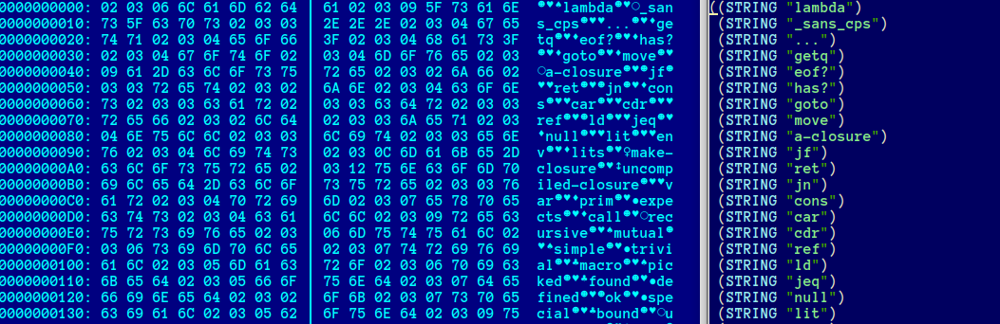
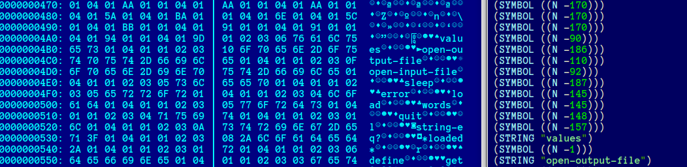

FASL File Format
================

FASL is acronim for FASt-Load format.
FASL formnat is internal and can be changed in the feature.


Glossary
--------
* byte, just an 8-bit octet.
* integer, big-endian multibyte sequence with signaling high bit.
* longint_t, integer with unlimited accuracy.


### Integer's Encoding

All integers are encoded in a big-endian multibyte sequence with signaling high bit.
That means a continuous stream of bytes with the least significant 6 bits and the most highest (7th) bit as a sequence flag. The last byte of sequence must have the 7th bit set to zero.

In other words, you should read a byte, if high bit is zero then return a value, if high bit is set then use 6 bits as part of result and repeat with next byte.

Pseudocode:
```c
	longint_t nat = 0;
	int i = 0;
	unsigned char ch;

	do {
		ch = read_next_byte();
		nat |= (ch & 0b01111111) << i;
		i += (8-1);
	} while (ch & 0b10000000);
	return nat;
```


Format
------

FASL data is a plain vector of tags with zero tag as end of stream.

```c
struct fasl_t
{
   tag_t items[N];
}
```

Every tag has a type in first byte and a variable length data strcture. All tag values extcept 0, 1, and 2 are reserved for feature use and should be interpret as invalid.

```c
struct tag_t
{
   byte tag;
   switch {
      // tag == 0;
      struct eos_t {}

      // tag == 1;
      struct obj_t;

      // tag == 2:
      struct raw_t;
   }
}
```

### eos_t

Empty tag. End Of Stream indicator.

```c
struct eos_t {}
```

### raw_t

Bytevectors, ansi strings, inexact numbers... Any object that has no other objects included. For such objects predicate `raw?` returns #true.

```c
struct raw_t
{
   byte type;
   integer length;
   byte payload[length];
}
```

The example of decoded part of fasl image with raw_t records and it's binary representation, "3" is a `type-string`:


### obj_t

Any other object than raw. For such objects predicate `raw?` returns #false and predicate `reference?` returns #true. No values (small integers, constants, small ports, etc.) are allowed.

```c
struct obj_t
{
   byte type;
   integer count;
   item_t payload[count];
}
```

Every item_t is either integer or reference to the previously decoded object.

```c
struct item_t
{
   switch {
      struct value_t {
         byte flag = 0;
         byte type;
         integer value;
      }

      integer reference > 0;
   }
}
```

The example of decoded part of fasl image with 'reference' and it's binary representation, "3" is a `type-symbol`:


### notes

You can convert type value into typename using `typename` function. For example,
```scheme
> (typename 3)
'type-string
```
