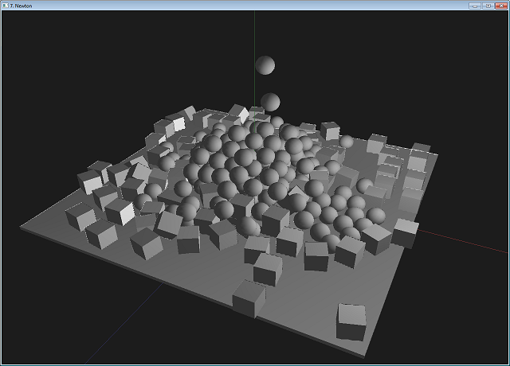

> Project news can be found in [russian translated](?ru) part of this site that frequently updates.
 

   Otus Lisp is a purely[*](#pure) functional dialect of Lisp.
It implements an extended subset of [R5RS](http://www.schemers.org/Documents/Standards/R5RS/) Scheme including, but not limited to some of the [SRFI](http://srfi.schemers.org/). It is small, embeddable and crossplatform.

   You can use it on Linux, Windows, *BSD, Android, webOS. It runs on x86, arm, mips architectures with 32- and 64-bit platforms.

   You can immediately try Otus Lisp (ol) in the provided terminal on the left of this page. For example, type
<pre><code id="sample1" data-language="scheme">(+ 1 2 3 4 5 6 7)</code><button class="doit" onclick="doit(sample1.textContent)">send to the terminal</button></pre>
   After pressing "Enter" button you will receive *28*.

   Or you can try more interesting example
<pre><code id="sample2" data-language="scheme">(fold * 1 (iota 99 1 1))</code><button class="doit" onclick="doit(sample2.textContent)">send to the terminal</button></pre>
which is another way of
<pre><code id="sample3" data-language="scheme">(let factorial ((n 99))
   (if (= n 0)
      1
      (* n (factorial (- n 1)))))</code><button class="doit" onclick="doit(sample3.textContent)">send to the terminal</button></pre>

   This will produce factorial of 99 for you
<pre><code>> (let factorial ((n 99))
   (if (= n 0)
      1
      (* n (factorial (- n 1)))))
933262154439441526816992388562667004
907159682643816214685929638952175999
932299156089414639761565182862536979
208272237582511852109168640000000000
000000000000

> 
</code></pre>

### Download

   Available binary builds for:
   
  * CentOS, Fedora, OpenSUSE, RHEL: https://build.opensuse.org/package/show/home:yuriy-chumak/ol
  * Debian, Ubuntu: https://build.opensuse.org/package/show/home:yuriy-chumak/ol
  
   I'm working for add more prebuilts.
   
### Project news
  * Wed 30 Nov 2016 17:19 EET
    * added full android support to the ol, now full list of supported platforms is armeabi, armeabi-v7a, arm64-v8a, mips, mips64, x86, x86-64
    * successfully tested sockets under android armeabi, it works fine:
<pre><code>
C:\>adb shell
# cd /data/local/tmp
# ./ol
You see a prompt.
Type ',help' to help, ',quit' to end session
> (import (lib http))
> ;; Library (lib http) added
> ;; Imported (lib http)
> (http:run 8080 (lambda (fd request headers send close)
   (print ":: " (syscall 51 fd #f #f))
   (send "HTTP/1.0 200 OK\n"
         "Connection: close\n"
         "Content-Type: text/html; charset=UTF-8\n"
         "Server: " (car *version*) "/" (cdr *version*)
         "\n\n"
         "<h1>200: OK</h1>"
         (ref request 1) ": " (ref request 2)
         "
<small>" headers
         "</small>")
   (close #t)
))
Server binded to 8080
.
.
# Wed Nov 30 16:56:01 2016 : new request from (10.0.2.2 . 53275)
:: (10.0.2.2 . 53275)
socket closed, on-accept done.
# Wed Nov 30 16:56:02 2016 : request processed in 772ms.
.
# Wed Nov 30 16:56:02 2016 : new request from (10.0.2.2 . 53278)
.
# Wed Nov 30 16:56:02 2016 : new request from (10.0.2.2 . 53279)
:: (10.0.2.2 . 53278)
socket closed, on-accept done.
# Wed Nov 30 16:56:03 2016 : request processed in 748ms.
.
# Wed Nov 30 16:56:03 2016 : new request from (10.0.2.2 . 53280)
:: (10.0.2.2 . 53279)
socket closed, on-accept done.
# Wed Nov 30 16:56:04 2016 : request processed in 2238ms.
socket closed, on-accept done.
# Wed Nov 30 16:56:09 2016 : request processed in 5737ms.
</code></pre>

  * Mon 28 Nov 2016 17:32 EET
    * changed assembler code for the x86 and x86-64 pinvoke mechanism, decreased side and increased speed. for testing use neton-dynamics and opengl libraries
      
    * now "native" function can return float and double values, ol understands it and correctly receives
  * Thr 10 Nov 2016 19:23 EET
    * nothing happend, i'm continuing the project, simply no time to the commenting all steps
  * Previous news records can be found in [russian translated](?ru) part of this site
  
### Learn

   Current news can be found in [russian translated](?ru) part of this site that frequently updates.

   I'm writing docs right now. It will be available very soon. You can check <b><a href="?en/examples">SAMPLES</a></b> for now.
