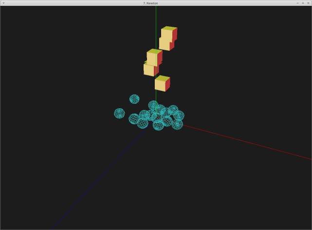
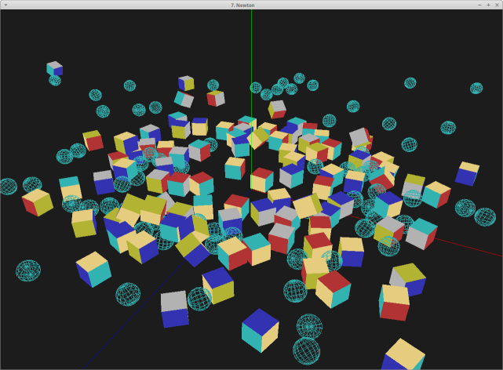
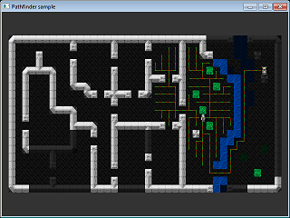
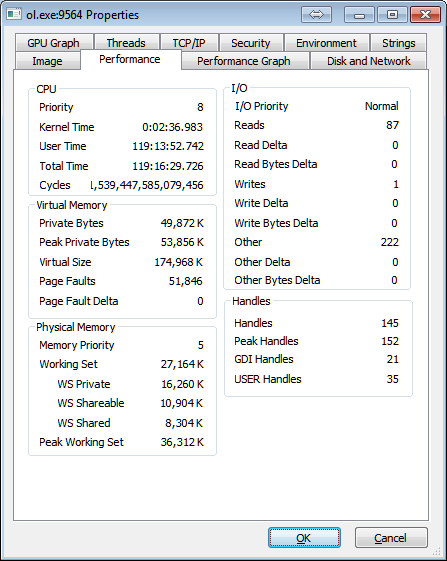
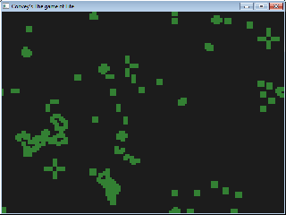

> Любая достаточно сложная программа содержит заново написанную, неспецифицированную, глючную и медленную реализацию половины какого-либо из диалектов Lisp.
>   Десятое правило Гринспена
 

### О проекте

   Otus Lisp (произносится как [`отэс лисп]), или сокращенно ol ([`ол]) - чисто функциональный[*](#pure) диалект языка Lisp.
Ol реализован как расширенное подмножество Scheme [R5RS](http://www.schemers.org/Documents/Standards/R5RS/), включая, но не ограничиваясь, некоторыми из [SRFI](http://srfi.schemers.org/). Маленький, встраиваемый, кроссплатформенный (Linux, Windows, BSD, Android, WebOS; 32 и 64-битные платформы; архитектуры x86 и arm).

   Распространяется по лицензии [GPL v3](https://github.com/yuriy-chumak/OL/blob/master/COPYING).

   Вот неполный список того, что может предоставить Ol:

  * маленькая и быстрая [виртуальная машина](?ru/internals/olvm) (всего 42 КБ[*](#42kb) в бинарном виде)
  * высокоэффективный, благодаря чистой функциональности языка, [сборщик мусора](?ru/internals/memory)
  * [встраиваемость](?ru/embed),
  * кроссплатформенность (Linux, Windows, BSD, Android, webOS, [MacOS, etc. - в реальных ближайших планах])
  * поддержка различных архитектур (x86, amd64, arm)
  * возможность компилировать ol-скрипты в бинарный формат (а так же, естественно, выполнять их)
  * динамическое связывание с функциями из "родных" [системных библиотек](?ru/pinvoke) (без использования других языков программирования, таких как C), а так же обратные вызовы из них же
  * обратные вызовы из "родных" системных библиотек
  * возможность работать в [песочнице](?ru/sandbox) [*](#sandbox)
  * интересные и полезные особенности из мира функционального программирования: 
    * продолжения
    * хвостовая рекурсия
    * [сопрограммы](?ru/subprograms)
    * функции, как объекты первого класса
  * ограниченные [сеттеры (мутаторы)](?ru/mutators), как маленькое приятное дополнение
  * и, что главное, это настоящий [Lisp](https://ru.wikipedia.org/wiki/%D0%9B%D0%B8%D1%81%D0%BF)!

   Вы можете сразу попробовать ol в деле в терминале на этой же страничке, если, конечно, терминал успешно подсоединился к серверу (поддержка удаленных клиентов все еще находится в экспериментальной стадии, возможны кратковременные сбои в работе).
   
   Например, попробуйте ввести
<pre><code id="fold1" data-language="scheme">(fold * 1 (iota 99 1 1))</code><button class="doit" onclick="doit(fold1.textContent)">отправить в терминал.</button></pre>

   После нажатия клавиши Enter вы должны получить красивое длинное число - результат вычисления факториала числа 99.
   
### Скачать (Download)

   Доступны бинарные сборки для некоторых операционных систем и архитектур:
   
  * CentOS, Fedora, OpenSUSE, RHEL: На [openSUSE Build Service](https://build.opensuse.org/package/show/home:yuriy-chumak/ol)
  * Debian, Ubuntu: Так же на [openSUSE Build Service](https://build.opensuse.org/package/show/home:yuriy-chumak/ol)
   
   Для остальных операционных систем соответствующие сборки тоже будут скоро доступны. Исходный код можно забрать на [странице проекта](https://github.com/yuriy-chumak/OL).
   
   Otus Lisp распространяется в виде двух исполнимых бинарных файлов - самостоятельной виртуальной машины (vm для Linux, vm.exe для Windows) и интерпретатора OL (ol и ol.exe соответственно). А так же набора библиотек.
   В качестве базовой библиотеки выступает repl - реализация языка Otus Lisp поверх базовых примитивов виртуальной машины.
   
   Командные строки для vm и ol совпадают с одинственным отличием, что виртуальная машина принимает только бинарные (предварительно скомпилированные) стрипты. В то время как интерпретатор принимает и бинарные, и текстовые.
   
   Примеры использования:
  * "./vm repl" - запустить интерактивную сессию REPL ("repl" - скомпилированный язык Otus Lisp, лежит в бинарном виде в корневой папке проекта), ждать ввода программы с консоли (клавиатуры)
  * "./ol" - аналог "./vm repl"
  * "./ol program.scm --seccomp" - выполнить program.scm в песочнице
  * "./ol - --seccomp <program.scm - аналог предыдущей команды, выполнить program.scm в песочнице
  * "./ol - --home /home/me/ol" - установить путь к библиотекам Otus Lisp в /home/me/ol и запустить интерактивную сессию REPL (если присутствуют аргументы командной строки, то первым всегда должно идти название файла, либо "-" для stdin)
   

### [Обучалка](?ru/tutorial)

   По [ссылке](?ru/tutorial) можно почитать детальнее про проект, а так же как программировать под ol и детали внутренней реализации. В общем все, что касается непосредственно языка и виртуальной машины (документация в процессе наполнения).

### Новости проекта

  * Mon 09 Sep 2016 13:46 EET
    * Я вышел из отпуска и скоро будут новые обновления проекта.

  * Tue 09 Aug 2016 23:38 EET
    * тестирую обратные вызовы на библиотеке newton-dynamics. сделал визуализацию миксом newton-dynamics+opengl, оно работает!
      
      
    * теперь можно попробовать opengl через glut, так как обратные вызовы работают, а glut требует именно их
    * проверил на 11000 (одиннадцати тысячах) объектах. стало притормаживать, но(!) мой лисп таки справляется с таким количеством (память не течет, обратные вызовы не текут, сборщик мусора справляется), и это не может не радовать! 
  * Sun 07 Aug 2016 00:23 EET
    * УРА! у меня заработали настоящие колбеки (обратные функции) - два месяца мозговых мучений наконец ознаменовались нормальным решением, в качестве примера и рабочей лошадки я использовать библиотеку [newton-dynamics](https://en.wikipedia.org/wiki/Newton_Game_Dynamics) и смог прикрутить к лиспу обработку физики.
      чуть позже оформлю все это добро примером на OpenGL, где будут падать кубики и мой дорогой Lisp сможет покорить еще одну вершину - математические расчеты в физических симуляциях! 

  * Thu 14 Jul 2016 18:26 EET
    * базовая реализация стейт-машины завершена. на прикладном уровне ничего не изменилось - тесты все так же выполняются, ничего в прикладном коде менять не надо. зато новая архитектура позволяет реализовать обратные вызовы и, например, подключить физическую библиотеку newton-dynamics, чем я скоро и займусь.
  * Mon 11 Jul 2016 17:54 EET
    * ввиду того, что обратные вызовы в текущей монолитной архитектуре реализовать сложно, было принято решение по преобразованию кода виртуальной машины из монолитных макарон в обычную стейт-машину. естественно, ценой некоторой потери производительности, но оно того должно стоить.
  * Fri 08 Jul 2016 17:28 EET
    * первые изменения кода, направленные на поддержку обратных вызовов из внешних библиотек.
    
  * Tue 05 Jul 2016 17:30 EET
    * немного почистил код
    
    

  * **Tue 14 Jun 2016 18:36 EET**
    * **релиз 1.0**!
    * добавил предсобранные бинарники для CentOS, Fedora, OpenSUSE, RHEL, Debian, Ubuntu; для убунты собираются сразу x86, x86_64, arm, ppc64le, aarch64.

  * Thr 09 Jun 2016 17:30 EET
    * добавил к терминалу скролл - теперь можно скроллить терминал мышью.

  * Tue 07 Jun 2016 23:10 EET
    * пересобрал систему на новом сервере, включил в ядре песочницу - теперь терминальные сессии снова работают.

  * Sat 04 Jun 2016 16:20 EET
    * закончил рефакторинг специальных форм, теперь их ровно 8 - quote, lambda, ol:set (привязка значения к символу в глобальном пространстве имен), ol:let (привязка значения к символу в локальной области видимости), values, receive, и два условных оператора ol:ifa (сравнение по арности) и ol:ifc (сравнение по условию).

  * Tue 24 May 2016 21:10 EET
    * большой рефакторинг специальных форм, теперь формы имеют не вводящие в заблуждение имена, добавил описание форм в документацию
      * вместо rlambda используется ol:let
      * вместо _branch используется ol:if
      * вместо _define используется ol:set
    * добавил к серверу удаленных сессий логгер в sqlite базу данных, теперь могу снимать автоматическую статистику
      * кстати, на протяжении всего времени видно, как на сервер пытаются ломиться всякие боты, которые ищут прокси и уязвимости - если дойдут руки, сделаю дайджест

  * Sun 22 May 2016 19:31 EET
    * добавил в командную строку параметр --home, указывающий где искать папку с библиотеками

  * Sat 21 May 2016 11:51 EET
    * исправил старинный баг со знаком ">" в запросе REPL
    * доделал sqlite библиотеку, добавил работающий пример
    * добавил в командную строку --versions параметр, теперь при компиляции в repl автоматически включается его версия (разные сборки repl теперь будут иметь различающуюся версию)

  * Mon 16 May 2016 07:04 EET
    * временные файлы в качестве источника кода больше не используются, для работы теперь необязателен доступ в дисковой системе на запись

  * Sat 14 May 2016 11:14 EET
    * первое изменение в командной строке, командная строка приведена к универсальному виду. 

  * Tue 10 May 2016 14:40 EET
    * ввиду долгой командировки и праздников обновлений почти не было - оно и хорошо, периодически от работы надо отдыхать что бы снова взяться за нее со свежими силами
    * зато теперь проект собирается под Android (и запускается, естественно - под любым консольным эмулятором). Из ограничений - под андроидом не работает песочница. Все остальное рабочее, можно тестить. Думаю, завтра запущу публичный тестовый веб-сервер (у меня дома есть старый телефон под андроидом, вот он и поработает тестовой платформой).

  * Sun 03 Apr 2016 22:47 CEST
    * исправил досадную ошибку, из-за которой под Linux не собиралась песочница (seccomp)
    * обновил програмное обеспечение сервера терминальных сессий Ol - теперь снова терминал на сайте работает

  * Wed 30 Mar 2016 15:43 EET
    * добавил поддержку OpenBSD (тестировал сборку на свежевышедшей 5.9 amd64)
    * добавил в документацию страничку [pinvoke](?ru/pinvoke)
    * добавил в документацию страничку [sandbox](?ru/sandbox)

  * Mon 28 Mar 2016 18:33 EET
    * довольно серьезный апдейт ломающий обратную совместимость - ну уж извините, пока никто не использует, имею право.
    * похоже, я наконец нашел конечную формулу для pinvoke типов. теперь это фиксированные type-int16 (алиас type-short), int32 (type-int), int64 и зависящий от платформы type-long. type-float и type-double остались старые. заодно модуль переместил на его место, где он и останется - папку otus/.
    * провел тест сборщика мусора - оставил покрутиться на недельку пример [с поиском пути](https://github.com/yuriy-chumak/OL/tree/master/tutorial/X.%20Path%20Finder) . учитывая, что для тестирования там все время гоняются туда-сюда списки (путь ищется в одном месте, а рисуется в другом) и регулярно дергается GC; что постоянно вызываются функции opengl (родные системные через pinvoke интерфейс) все отработало на ура - никаких падений и никаких утечек памяти.
      прилагаю памятный скрин: .

  * Fri 25 Mar 2016 13:08 EET
    * была у меня тут надобность быстро сгенерировать один большой и несколько сложный json, так под это дело родился модуль (lib json), который просто и незатейливо переводит s-выражение в текстовую json нотацию - поддерживаются строки, символы, числа (даже с плавающей точкой - до четвертого знака), массивы(!). Вот такой код (timestamp - внешняя функция, t - переменная цикла) легко и незатейливо превращается в соответствующий json:
<pre><code>
   ; lisp:
   (jsonify "   " `(
      (command . "command1")
      (timestamp . ,(timestamp t))
      (params . (
        (value . (
          (position . (
            (x . 0)
            (y . 1.5)
            (z . ,(- t))
          ))
          (rotation . (
            (x . 0)
            (y . 0)
            (z . 0)
            (w . 1)
          ))
        ))
      ))
   ))
   ; json:
   "command": "command1",
   "timestamp": 500000,
   "params": {
     "value": {
       "position": {
         "x": 0,
         "y": 1.5000,
         "z": -5
       },
       "rotation": {
         "x": 0,
         "y": 0,
         "z": 0,
         "w": 1
       }
     }
   }</code></pre>

  * Thr 24 Mar 2016 16:55 EET
    * в скрипт сборки под Windows добавил автоматическую сборку под виртуалкой с FreeBSD. Когда найду время, сделаю такое-же и для остальных систем. удобно, однако! написал make 105 и вуаля, оно собирается и сообщает о возможных ошибках сборки.
  
  * Mon 21 Mar 2016 17:27 EET
    * добавил в примеры [convey's game of life](https://ru.wikipedia.org/wiki/%D0%96%D0%B8%D0%B7%D0%BD%D1%8C_%28%D0%B8%D0%B3%D1%80%D0%B0%29), для просторы зациклив ее в мире 128х96. приятно, когда один раз написанный код работает под разными используемыми системами без изменений. пример забирать [из репозитория](https://github.com/yuriy-chumak/OL/tree/master/tutorial/Convey's%20Life), начальный мир задается битмапкой initial.bmp (можно редактировать). 
  
  * Sun 20 Mar 2016 18:17 EET
    * поправил сломанный pinvoke
  
  * Fri 18 Mar 2016 21:25 EET
    * поправил сборку под хBSD
    * вынес в srfi-1 (где им и место) приятные функции first, second, third, fourth, ..., eighth, ninth, tenth. без них лисп какой-то не лисп )

  * Thr 17 Mar 2016 14:41 EET
    * добавил в список поддерживаемых операционных систем NetBSD (тестил на NetBSD 7.0).

  * Tue 15 Mar 2016 18:54 EET
    * добавил в список поддерживаемых операционных систем FreeBSD (тестил на FreeBSD 10.2). 

  * Mon 14 Mar 2016 19:51 EET
    * продолжаю работу по унификации виртуальной машины. арифметические операции теперь соответствуют [описанию](?ru/internals/numbers) (которое как раз и дописываю).

  * Sun 13 Mar 2016 16:30 EET
    * привел функцию iota в соответствие с [srfi-1](http://srfi.schemers.org/srfi-1/srfi-1.html), старая функция теперь называется lrange и в скором времени будет объявлена как deprecated.
    * добавил в язык константу #eof, раньше она существовала неявно и работала через функцию eof-object?, теперь можно сравнивать как обычно - (eq? object #eof).
    * наконец-то нашел правильное название для библиотеки базовой реализации r5rs стандарта - (r5rs core).

  * Wed 12 Mar 2016 23:48 EET
    * очень важный апдейт - реализовал функцию (set! object n value), которая меняет n-й элемент объекта object на value. обязательное      условие, value должно быть value типа (кроме чисел подходят константы #t, #f и т.д.) 
    * port теперь снова value-type, временная завязка на port, как handle для pinvoke больше не нужна, так как появился свой внутренний тип. ol будет чуть быстрее обрабатывать файлы.
    * поправил билд под linux, не собиралась функция getrusage.

  * Wed 12 Mar 2016 18:31 EET
    * cast теперь умеет создавать порт из чисел 0, 1 и 2 (stdin, stdout и stderr, соответственно).
    * отключил в ol неработающие внутренние команды goto-code, goto-proc и goto-clos (и из olvm тоже). никакого влияния на ol это не оказывает.
    * теперь fx:< называется less? и может сравнивать не только value числа. вместе с eq? образует логичную и законченную пару компараторов.
    * удалил устаревшие sizeb и refb. добавил новую команду виртуальной машины (raw?), которая соответствует названию.
    * size теперь работает двояко - для raw объектов возвращает их размер в байтах, для простых объектов - в элементах. Так будет логичнее всего (так как байты - элементы для raw объектов). Аналогично с функцией ref.

  * Wed 02 Mar 2016 16:10 EET
    * теперь функция sizeb отмечена как устаревшая (deprecated) и будет удалена в ближайшее время.
    * поправил эффект "цифрового дождя" в туториалах, теперь работает правильно.
    
  * Fri 27 Feb 2016 16:27 EET
    * добавил заготовку странички [описания команд](?ru/internals/olvm) вируальной машины ol

  * Fri 27 Feb 2016 13:03 EET
    * теперь под Windows дефолтная папка для библиотек OL_HOME (или C:\Program Files\OL по умолчанию, будет меняться когда сделаю инсталлятор)
    * uname теперь официальная функция в составе (owl sys), заканчиваю ее полноценную реализацию для Windows (в смысле названия ОС и ее варианта)
    * вернул работу vm.exe под Windows, не работала
    * запилил в туториалах эффект "цифровой дождь" с целью потестировать мутаторы (сеттеры). по результатам буду вводить операторы в основной язык.  

  * Tue 23 Feb 2016 00:43 EET
    * дописал часть OpenGL туториала
    * добавил пример ai, который ищет путь в лабиринте не зная всей карты (строит карту "в уме" на основании тех частей, которые видит и "забывая" те ее части, которые видел достаточно давно)
  * [Архив](https://github.com/yuriy-chumak/OL/commits/master)

### Мои заметки
   * [О бинарных пакетах в NetBSD](?blog/2016.03.17-13.06)
   
   
   
### (*) Сноски

  * На самом деле Otus Lisp немного расширен в сторону традиционного императивного программирования, а именно введены лимитированные [мутаторы](?ru/mutators).
  * 42КБ для Linux 64bit. Для других операционных систем, а так же с другими параметрами сборки размер может отличаться как в большую, так и в меньшую сторону (для win64 amd64 - 79 KB, для ubuntu64 armhf - 30 KB).
  * Режим песочницы поддерживается только для ОС, в которых реализован [SECCOMP](https://en.wikipedia.org/wiki/Seccomp) (secure computing mode) - это Linux (и разные его дистрибутивы, Ubuntu, Debian, Suse, etc.)