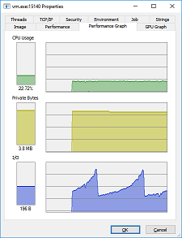

> Любая достаточно сложная программа содержит заново написанную, неспецифицированную, глючную и медленную реализацию половины какого-либо из диалектов Lisp.
>   Десятое правило Гринспена
 

Otus Lisp (произносится как [\`отэс лисп]), или сокращенно Ol ([\`ол]) - чисто[\*](#pure) функциональный диалект языка Lisp.

Ol реализован как расширенное подмножество Scheme [R5RS](http://www.schemers.org/Documents/Standards/R5RS/), включая, но не ограничиваясь, некоторыми из [SRFI](http://srfi.schemers.org/). Маленький, встраиваемый и кроссплатформенный; может работать в песочнице (в системах, где песочница поддерживается); предоставляет портабельный, высокоуровневый путь для вызова написанного на других языках кода. Вы можете использовать его под Linux, Windows, Unix, Android и многих других операционных системах на разных (например, x86, arm, aarch64, mips, ppc) архитектурах.

### Загрузка
Релиз **1.1** вышел и готов к [скачиванию](https://github.com/yuriy-chumak/ol/releases). Приятного ЛИСПинга!

Готовится в выпуску релиз 1.2

### Протестированные платформы
- [x] x86: 80486, pentium, pentium 2, pentium 3, athlon, core 2 quad, core i3, core i5, core i7.
- [x] x86_64: core 2 quad, core i3, core i5, core i7.
- [x] aarch64: cortex-a53, cortex-a57.
- [x] arm: arm920t, snapdragon 801.
  - nearly planned, but not yet tested: arm926t, arm1136, cortex-a7, cortex-a9, cortex-a15, cortex-m3, cortex-m4.
- fully supported, but not yet tested: m68k, microblaze, mips32, mips64, or1k, ppc, ppc64, sh4, spark, spark64, ztensa.

### Протестированные операционные системы/устройства
- [x] Linux: CentOS, Debian, Fedora, RHEL, SLE, ScientificLinux, Uninvention, openSUSE, Ubuntu.
- [x] Windows: Windows 95, Windows 98, Windows ME, Windows NT, Windows 2000, Windows XP, Windows Vista, Windows 7, Windows 8, Windows 10.
- [x] Unix: OpenBSD, FreeBSD, NetBSD.
- [x] Android: all versions up to Nougat.
- [x] webOS: 2.0.
- [x] Odroid: C1.

### О проекте
Otus Lisp распространяется по лицензии [LGPL v3](https://github.com/yuriy-chumak/ol/blob/master/COPYING.LESSER).

Вот неполный список того, что может вам предоставить Ol:

* маленькая и быстрая [виртуальная машина](?ru/internals/olvm) (всего 42 КБ[\*](#42kb) в бинарном виде)
* высокоэффективный, благодаря чистой функциональности языка, [сборщик мусора](?ru/internals/memory)
* [встраиваемость](?ru/embed),
* кроссплатформенность (Linux, Windows, BSD, Android, webOS, [MacOS, etc. - в реальных ближайших планах])
* поддержка различных архитектур (i586, amd64, arm, mips, etc.)
* поддержка 32- и 64-битных платформ
* возможность компилировать ol-скрипты в бинарный формат; а так же, естественно, выполнять их
* динамическое связывание с функциями из "родных" [системных библиотек](?ru/pinvoke) (без использования других языков программирования, таких как C), а так же обратные вызовы из них же
* возможность работать в [песочнице](?ru/sandbox) [\*](#sandbox)
* полный спектр интересных и полезных особенности из мира функционального программирования:
  * продолжения
  * хвостовая рекурсия
  * [сопрограммы](?ru/subprograms)
  * функции, как объекты первого класса
* ограниченные [сеттеры (мутаторы)](?ru/mutators), как маленькое приятное дополнение из императивного мира
* и, что главное, это настоящий [Lisp](https://ru.wikipedia.org/wiki/%D0%9B%D0%B8%D1%81%D0%BF)!

Вы можете сразу попробовать ol в деле в терминале на этой же страничке без скачивания и установки любых бинарных файлов. Примеры можно посмотреть в конце этой страницы.

### Новости разработки 
* Mon 3 Oct 2017
  * лицензия проекта заменена с GPLv3 на LGPLv3

* Mon 2 Oct 2017
  * важный фикс: исправлено потребление виртуальной машиной ресурсов в интерактивном режиме, это был блокирующий выпуск релиза баг, так что можно наконец заняться подготовкой выпуска

* Sun 1 Oct 2017
  * c++ interface fix
  * новый механизм подмены стандартных портов в/в в виртуальной машине

* Thr 28 Sep 2017
  * обновлена поддержка android

* Thr 21 Sep 2017
  * (list-ref) теперь часть (r5rs core) библиотеки
  * пачка чисток кода и перемещений функций

* Wed 20 Sep 2017
  * новые inexact функции - fmax fmin

* Tue 19 Sep 2017
  * теперь dlopen работает молча под windows (не выскакивает окошко "dll not found")
  * удалил src/boot.c файл из репозитария (который по факту являлся копией repl, но в виде пригодном для компиляции С компилятором. теперь для сборки ol надо проделать на один шаг больше, но зато экономится 1,5M в репозитории каждый раз, когда меняется язык. почему я этого не сделал раньше, не понимаю?
  * новая функция в srfi-1 (xcons)
  * native api change: удалил опциональный деструктор в OL_new() остававшийся там по историческим причинам
  * pinvoke переименован в более привычный всем ffi, прощайте ассоциации с c# :)
  * а еще переименовал type-callback в type-callable, более правильное название сущности, естественно
  * пачка фиксов для inexact математики

* Mon 18 Sep 2017
  * улучшение GC (gc теперь чистит перед сборкой ненужные регистры, что позволяет дополнительно освобождать до 1.5% от освобождаемой перед этим памяти). пока не особо уверен, что оно того стоит.
  * новая функция srfi-1 (filter)

* Mon 7 Aug 2017
  * добавил inexact fsqrt, fsin, fcos, fadd, fsub, fmul, fdiv функции
  * ol теперь умеет печатать неточные числа в читабельном виде (чистичная поддержка)

* Mon 31 Jul 2017
  * добавил базовую поддержку inexact чисел - "неточных", зато быстрых чисел, для включения в код надо задать OLVM_INEXACTS=1 при сборке

* Mon 25 Jul 2017
  * добавлен автотест на pinvoke

* Mon 24 Jul 2017
  * изменение базового API!!!
    * apply-value изменен на values-apply, теперь этот примоп пишется так, как работает
    * ol:let изменен на bind
  * изменение внешнего API!!!
    * OL_eval изменен на OL_run
  * vm:run перемещен из lang/thread в базовую библиотеку src/vm
  * lang/thread переименован в lang/threading

* Fri 21 Jul 2017
  * исправил сломанный тест на поддержку библиотек
  * небольшой рефакторинг кода, меньше magic numbers
  * изменение базового API!!!
    * vm:raw изменен на vm:new-raw-object
    * unreel изменен на vm:new-object
    * raw? изменен на vm:raw?

* Tue 18 Jul 2017
  * немного поправил gc, должен работать еще немного стабильнее
  * добавил системный вызов pipe (для win32 тоже)
  * научил ol печатать значение порта в форме #[fd 123]
  * немного изменил логику задания поддержки песочницы в коде

* Mon 17 Jul 2017
  * tcl/tk базовые биндинги теперь и под линукс
  * изменен public API!!!
    * OL_eval возвращает неконвертированное значение, таким образом вызывающий может его проанализировать
  * добавил еще внутренних тестов виртуальной машины
  * добавил поддержку расширений для sqlite, теперь их можно писать прямо на ol
  * добавил пример расширения для sqlite на ol
  * изменен внутренний API!!!
    * номер внутреннего вызова создания колбека изменен с 175 на 85

* Thr 6 Jul 2017
  * потестил ol под aarch64 и arm versatile, работает, можно добавлять в описание.

* Fri 30 Jun 2017
  * добавил поддержку [Minoca OS](https://www.minocacorp.com/) - интересной маленькой ОСи для всякого эмбеддеда

* Thr 22 Jun 2017
  * начат процесс интегрирования в OL иррациональных (inexact) чисел.

* Fri 12 Jun 2017
  * начат новый тестовый проект с OL в качетве бекэнда, это поможет мне улучшить как виртуальную машину, так и общие библиотеки. но теперь OL будет получать меньше моего внимания. хотя увидим...

* Fri 12 Jun 2017
  * исправил функцию (read)

* Thr 11 Jun 2017
  * научил sqlite выводить текст ошибки

* Wed 10 Jun 2017
  * теперь http умеет парсить векторы в строке
  * в sqlite добавил сеттер null

* Tue 9 Jun 2017
  * больше кодов ошибок в sqlite
  * новый json принтер
  * добавил из тестового проекта сложную sqlite:query функцию, посмотрим приживется ли

* Mon 8 Jun 2017
  * добавил поддержку constraints в sqlite

* Sat 6 Jun 2017
  * новый syscall (unlink), теперь ol умеет удалять файлы

* Tue 2 Jun 2017
  * изменил http парсер, теперь он умеет парсить командную строку и разбивать ее на хеш-таблицу пар ключ-значение
  * фикс системного вызова sendfile, теперь sendfile работает нормально
  * новая функция yield

* Wed 31 May 2017
  * юнит-тесты виртуальной машины внесены в общий автоматизированный список - будем теперь сразу тестить регрессию

* Fri 26 May 2017
  * общая чистка проекта, отключенные и инвалидные тесты перенесены в папку disabled, остальные мелочи

* Wed 24 May 2017
  * выписал табличку кодов виртуальной машины, теперь неиспользуемые коды легко вычислить

* Tue 23 May 2017
  * talkback интерфейс теперь перемещен в extensions, как и планировалось раньше
  * немного почистил код поддержки обратных вызовов
  * так же пофиксил тикет "OLVM doesn't close file descriptors after error" (относящийся к talkback)

* Mon 22 May 2017
  * добавил наброски юнит-тестов на виртуальную машину

* Thr 27 Apr 2017
  * в talkback семпл добавлен пример по передаче в OL и возвращению оттуда же битового массива
  * раздумываю над тем, чтобы talkback выделить отдельно как библиотеку/фреймворк

* Wed 26 Apr 2017
  * добавлен хук на "import" для OL, после тестирования отправлю в мейнлайн - теперь поведение импорта можно изменить прямо из пользовательского скрипта

* Mon 24 Apr 2017
  * добавил обработку ошибок к talkback интерфейсу - теперь talkback сигнализирует ошибку и возвращает ее текстовое описание

* Fri 21 Apr 2017
  * больше примеров (добавил использование сопрограмм)

* Mon 17 Apr 2017
  * расширил talkback пример
  * talkback теперь умеет делать "import" и ",load"
  * почистил ворнинги

* Fri 14 Apr 2017
  * пофиксил дурацкий ворнинг под новую glibc
  * фикс для менеджера памяти, тоже касается выделения больших блоков памяти
  * добавил хук на exit(), который позволяет отлавливать попытку OL закрыть программу - ставится через OL_atexit()
  * вроде как поправил баг со 100% загрузкой cpu в idle режиме

* Thr 13 Apr 2017
  * первая реализация экспериментального интерфейса talkback - связки C и OL модулей, позволяющая упрощенно запускать скрипты на OL из С и получать ответы
  * исплавил баг с возможным корраптом кучи при запросе объекта слишком большого размера в vm:raw

* Wed 12 Apr 2017
  * многочисленные мелкие фиксы встроенного функционала

* Wed 12 Apr 2017
  * хех, первые тикеты не от меня!
  * поправил embed доку и функционал, ибо застарели а руки все не доходили.
  * поправил мастер, так как завтыкал один файл - надо будет добавить себе проверку в автотесты.

* Tue 28 Mar 2017
  * мелочи, добавил к sysinfo для win32 немного инфы

* Tue 21 Mar 2017
  * еще больше openal (pcm, a-law декодеры, правда нормально еще не тестил, некогда)

* Mon 20 Mar 2017
  * пачка изменений в примитивных командах:
    * поправил set-ref!
    * теперь vm:raw принимает размер выделяемого буфера, так что можно наконец обойтись без repeat и просадки на создании списка
  * добавил новую команду endianness виртуальной машине. теперь можно узнать что же у нас за endianness-железо такое
  * openal перенес в либы, ибо уже можно пользоваться

* Fri 17 Mar 2017
  * добавил базовую имплементацию для OpenAL - а то что это такое, рисовать умею, а музыку играть нет? вот, теперь можно сопровождать свои демки какими-то звуками. надо будет попробовать стуки в opengl+newton демку добавить.

* Thr 16 Mar 2017
  * ускорил map и привел к r5rs виду fold

* Wed 15 Mar 2017
  * параллельно запустил репозиторий yuriy-chumak/meala с визуальной новеллой (сценарист сторонний), где вполне успешно выходит набросать портабельную реализацию скрипта для визуализации игрового сценария. даже прилепил визуализатор на opengl. а что, вполне неплохо получается! еще одна демонстрация мощи ol в общую копилку )

* Mon 13 Mar 2017
  * в pinvoke добавил port
  * в билд скрипты добавил поддержку wasm (не оттестировано еще)
  * новая библиотека (lib rlutil), позволяющая универсально (win32/linux) работать с терминалом
  * в (lib opengl) gl:SwapBuffers стала универсальной

* Mon 27 Feb 2017
  * поправил stat syscall

* Fri 24 Feb 2017
  * в io модуле сменил название инициализатора, планирую со временем ввести "конструкторы" модулей (автовыполняющиеся функции)

* Thr 23 Feb 2017
  * в "тонкой" версии поправил инициализацию окружения, уменьшил размер бинарника
  * добавил переменные окружения - индикаторы srfi, пока в качестве эксперимента

* Wed 22 Feb 2017
  * пытаюсь реализовать fork на win32, туговато идет

* Mon 20 Feb 2017
  * хе-хе, теперь у нас есть brainf**k интерпретатор на лиспе, заодно забросил его в [rosetta code](http://rosettacode.org/wiki/Category:Ol).
  * пофиксил set-ref и set-ref!, теперь они корректно работают со знаковыми параметрами
  * bf вполне работает - проверено на bf self interpreter

* Fri 17 Feb 2017
  * добавил совместимый с r5rs модуль (r5rs characters)
  * обновил лицензию в ol.scm

* Mon 13 Feb 2017
  * с этого момента не буду в новостях постить время, не имеет особого смысла
  * JF2 переименована в JAF (Jump if Arity Failed)

* Tue 07 Feb 2017 18:19 CET
  * релиз неплохо себя показывает в боевых условиях - сервер бегает и не падает, память не жрет, ресурсов потребляет меньше.
  * большой апдейт - ol теперь портирован под Web, так что его можно использовать прямо в веб-страничках. примеры я готовлю и после тестов выкачу в паблик. текущую реализацию и примеры можно увидеть в develop ветке и в ветке stars! после того, как все будет оттестировано, придется делать новый релиз. кстати, бегает вполне быстро.
  * добавил набросок (lib libcurl) к библиотекам
  * фиксы в математической библиотеке

* *Fri 30 Dec 2016 17:06 EET*
  * *релиз 1.1 вышел.*

* Thr 29 Dec 2016 16:58 EET
  * сегодня у нас в меню особое блюдо под названием flattening. вот и пришла пора снова собрать весь главный цикл виртуальной машины в одну монструозную функцию. с точки зрения программирования это "некрасиво" и достойно порицания, зато тестовая числодробилка на Odroid вместо 33 секунд стала выполняться за 22.

* Wed 28 Dec 2016 18:15 EET
  * пререлиз 1.1 вышел. последним коммитом было исправление математики на 64-разрядных системах (* 4294967296 -1)=0.
  * осталось провести многочисленные тесты, проверить что ничего не сломалось и можно выпускать релиз - интересно, выпущу еще в 2016, или уже в 2017?

* Tue 27 Dec 2016 18:20 EET
  * иногда ошибки бывают настолько глупыми, что диву даешься. в общем, я наконец-то серьезно (как уже давно планировал) взялся за стратегию распределения памяти в куче. с учетом вчерашних наработок, и, что главное, исправленной пары совершенно глупейших ошибок, получил гигантское ускорение - в два раза - и гигантское уменьшение потребления памяти - в три-пять раз, зависит от размера программы.
  * троекратное ура. на этом фоне можно готовиться выпускать релиз, что я, наверное, и попытаюсь сделать до новогодних праздников.
  * прикладываю картинку с наглядным представлением как во времени работает сборка мусора. вот эти пилы - частота вызова сборки и, по совместительству, размер занятой памяти в куче:

    

* Mon 26 Dec 2016 15:56 EET
  * довольно серьезное изменение - переделал стратегию распределения количества памяти, выделенной куче. заодно исправил пару багов. ну что я могу сказать... памяти машина стала есть в три-пять раз меньше, судя по графикам распределения, а так же правильнее (нету больше странных скачков туда-сюда), но работать стала немного медленнее, так как чаще вызывается сборка мусора.

* Thr 01 Dec 2016 18:06 EET
  * поправил проект под автоматическую сборку, теперь на [build.opensuse.org](https://build.opensuse.org/package/show/home:yuriy-chumak/ol) снова можно забирать актуальные версии проекта, в данном случае под x86 CentOS 6, x86 Debian 7, x86 Debian 8, x86 Fedora 22, x86 Fedora 23, x86 RHEL 5, x86 RHEL 6, x86 ScientificLinux 6, x86 openSUSE 13.1, x86 openSUSE 13.2, armv7l openSUSE Factory, aarch64 openSUSE Factory, x86 Ubuntu 12.04, x86 Ubuntu 14.04, x86 Ubuntu 16.04

* Wed 30 Nov 2016 21:53 EET
  * пересобрал ol под odroid со всеми последними изменениями - пускай потрудится в боевых условиях (напомню, что терминал на странице работает на odroid c1+, веб-сервер бегает под управлением ol)

* Wed 30 Nov 2016 16:57 EET
  * собрал и запустил ol под андроид! теперь в список официально поддерживаемых платформ можно добавить armeabi, armeabi-v7a, arm64-v8a, mips, mips64.
  * проверил под андроидом работу сокетов, работают:
<pre><code>
C:\>adb shell
# cd /data/local/tmp
# ./ol
You see a prompt.
Type ',help' to help, ',quit' to end session
> (import (lib http))
> ;; Library (lib http) added
> ;; Imported (lib http)
> (http:run 8080 (lambda (fd request headers send close)
   (print ":: " (syscall 51 fd #f #f))
   (send "HTTP/1.0 200 OK\n"
         "Connection: close\n"
         "Content-Type: text/html; charset=UTF-8\n"
         "Server: " (car *version*) "/" (cdr *version*)
         "\n\n"
         "200: OK")
   (close #t)
))
Server binded to 8080

# Wed Nov 30 16:56:01 2016 : new request from (10.0.2.2 . 53275)
:: (10.0.2.2 . 53275)
socket closed, on-accept done.
# Wed Nov 30 16:56:02 2016 : request processed in 772ms.
</code></pre>

* Mon 28 Nov 2016 17:32 EET
  * вышел из вынужденного отпуска, сразу заливаю очередной апдейт проекта
  * переделал ассемблерный код для x86 и x64 pinvoke, еще сильнее сократил размер и сделал код еще проще. в качестве тестов использую тот же newton-dynamics и opengl
    
  * теперь "родные" функции умеют корректно возвращать float и double значения (с плавающей запятой)

* Thr 10 Nov 2016 19:23 EET
  * без паники, проект разрабатывается дальше.
  * (просто не было времени на написание новостей, но выделю и напишу; тем более есть о чем написать)
  * а вообще сегодня исправил очень досадный баг с __cdecl в pinvoke механизме
  * и реализовал ассемблерные(!) вызовы функций для x86 windows/linux/unix pinvoke механизма, что позволило мне вполне-вполне уменьшить размер виртуальной машины! и, что самое приятное, теперь pinvoke в этих платформенных условиях спокойно может обрабатывать любую комбинацию параметров.

* Mon 26 Sep 2016 17:11 EET
  * Сейчас я сосредоточился на другом проекте, который использует Otus Lisp как среду исполнения, таким образом будет проведено дополнительное тестирование.
  Чтобы проект не казался заброшенным, я, наверное, буду вести этот проект в отдельной ветке главного репозитория; внося нужные правки в общее дерево.

* Mon 09 Sep 2016 13:46 EET
  * Я вышел из отпуска и скоро будут новые обновления проекта.

* Tue 09 Aug 2016 23:38 EET
  * тестирую обратные вызовы на библиотеке newton-dynamics. сделал визуализацию миксом newton-dynamics+opengl, оно работает!
    
    
  * теперь можно попробовать opengl через glut, так как обратные вызовы работают, а glut требует именно их
  * проверил на 11000 (одиннадцати тысячах) объектах. стало притормаживать, но(!) мой лисп таки справляется с таким количеством (память не течет, обратные вызовы не текут, сборщик мусора справляется), и это не может не радовать!

* Sun 07 Aug 2016 00:23 EET
  * УРА! у меня заработали настоящие колбеки (обратные функции) - два месяца мозговых мучений наконец ознаменовались нормальным решением, в качестве примера и рабочей лошадки я использовал библиотеку [newton-dynamics](https://en.wikipedia.org/wiki/Newton_Game_Dynamics) и смог прикрутить к лиспу обработку физики.
  чуть позже оформлю все это добро примером на OpenGL, где будут падать кубики и мой дорогой Lisp сможет покорить еще одну вершину - математические расчеты в физических симуляциях!

* Thu 14 Jul 2016 18:26 EET
  * базовая реализация стейт-машины завершена. на прикладном уровне ничего не изменилось - тесты все так же выполняются, ничего в прикладном коде менять не надо. зато новая архитектура позволяет реализовать обратные вызовы и, например, подключить физическую библиотеку newton-dynamics, чем я скоро и займусь.

* Mon 11 Jul 2016 17:54 EET
  * ввиду того, что обратные вызовы в текущей монолитной архитектуре реализовать сложно, было принято решение по преобразованию кода виртуальной машины из монолитных макарон в обычную стейт-машину. естественно, ценой некоторой потери производительности, но оно того должно стоить.

* Fri 08 Jul 2016 17:28 EET
  * первые изменения кода, направленные на поддержку обратных вызовов из внешних библиотек.

* Tue 05 Jul 2016 17:30 EET
  * немного почистил код

* **Tue 14 Jun 2016 18:36 EET**
  * **релиз 1.0**!
  * добавил предсобранные бинарники для CentOS, Fedora, OpenSUSE, RHEL, Debian, Ubuntu; для убунты собираются сразу x86, x86_64, arm, ppc64le, aarch64.

* Thr 09 Jun 2016 17:30 EET
  * добавил к терминалу скролл - теперь можно скроллить терминал мышью.

* Tue 07 Jun 2016 23:10 EET
  * пересобрал систему на новом сервере, включил в ядре песочницу - теперь терминальные сессии снова работают.

* Sat 04 Jun 2016 16:20 EET
  * закончил рефакторинг специальных форм, теперь их ровно 8 - quote, lambda, ol:set (привязка значения к символу в глобальном пространстве имен), ol:let (привязка значения к символу в локальной области видимости), values, receive, и два условных оператора ol:ifa (сравнение по арности) и ol:ifc (сравнение по условию).

* Tue 24 May 2016 21:10 EET
  * большой рефакторинг специальных форм, теперь формы имеют не вводящие в заблуждение имена, добавил описание форм в документацию
    * вместо rlambda используется ol:let
    * вместо _branch используется ol:if
    * вместо _define используется ol:set
  * добавил к серверу удаленных сессий логгер в sqlite базу данных, теперь могу снимать автоматическую статистику
    * кстати, на протяжении всего времени видно, как на сервер пытаются ломиться всякие боты, которые ищут прокси и уязвимости - если дойдут руки, сделаю дайджест

* Sun 22 May 2016 19:31 EET
  * добавил в командную строку параметр --home, указывающий где искать папку с библиотеками

* Sat 21 May 2016 11:51 EET
  * исправил старинный баг со знаком ">" в запросе REPL
  * доделал sqlite библиотеку, добавил работающий пример
  * добавил в командную строку --versions параметр, теперь при компиляции в repl автоматически включается его версия (разные сборки repl теперь будут иметь различающуюся версию)

* Mon 16 May 2016 07:04 EET
  * временные файлы в качестве источника кода больше не используются, для работы теперь необязателен доступ в дисковой системе на запись

* Sat 14 May 2016 11:14 EET
  * первое изменение в командной строке, командная строка приведена к универсальному виду.

* Tue 10 May 2016 14:40 EET
  * ввиду долгой командировки и праздников обновлений почти не было - оно и хорошо, периодически от работы надо отдыхать что бы снова взяться за нее со свежими силами
  * зато теперь проект собирается под Android (и запускается, естественно - под любым консольным эмулятором). Из ограничений - под андроидом не работает песочница. Все остальное рабочее, можно тестить. Думаю, завтра запущу публичный тестовый веб-сервер (у меня дома есть старый телефон под андроидом, вот он и поработает тестовой платформой).

* Sun 03 Apr 2016 22:47 CEST
  * исправил досадную ошибку, из-за которой под Linux не собиралась песочница (seccomp)
  * обновил програмное обеспечение сервера терминальных сессий Ol - теперь снова терминал на сайте работает

* Wed 30 Mar 2016 15:43 EET
  * добавил поддержку OpenBSD (тестировал сборку на свежевышедшей 5.9 amd64)
  * добавил в документацию страничку [pinvoke](?ru/pinvoke)
  * добавил в документацию страничку [sandbox](?ru/sandbox)

* Mon 28 Mar 2016 18:33 EET
  * довольно серьезный апдейт ломающий обратную совместимость - ну уж извините, пока никто не использует, имею право.
  * похоже, я наконец нашел конечную формулу для pinvoke типов. теперь это фиксированные type-int16 (алиас type-short), int32 (type-int), int64 и зависящий от платформы type-long. type-float и type-double остались старые. заодно модуль переместил на его место, где он и останется - папку otus/.
  * провел тест сборщика мусора - оставил покрутиться на недельку пример [с поиском пути](https://github.com/yuriy-chumak/ol/tree/master/tutorial/X.%20Path%20Finder) . учитывая, что для тестирования там все время гоняются туда-сюда списки (путь ищется в одном месте, а рисуется в другом) и регулярно дергается GC; что постоянно вызываются функции opengl (родные системные через pinvoke интерфейс) все отработало на ура - никаких падений и никаких утечек памяти.
  прилагаю памятный скрин:
    .

* Fri 25 Mar 2016 13:08 EET
  * была у меня тут надобность быстро сгенерировать один большой и несколько сложный json, так под это дело родился модуль (lib json), который просто и незатейливо переводит s-выражение в текстовую json нотацию - поддерживаются строки, символы, числа (даже с плавающей точкой - до четвертого знака), массивы(!). Вот такой код (timestamp - внешняя функция, t - переменная цикла) легко и незатейливо превращается в соответствующий json:
<pre><code>
   ; lisp:
   (jsonify "   " `(
      (command . "command1")
      (timestamp . ,(timestamp t))
      (params . (
        (value . (
          (position . (
            (x . 0)
            (y . 1.5)
            (z . ,(- t))
          ))
          (rotation . (
            (x . 0)
            (y . 0)
            (z . 0)
            (w . 1)
          ))
        ))
      ))
   ))
   ; json:
   "command": "command1",
   "timestamp": 500000,
   "params": {
     "value": {
       "position": {
         "x": 0,
         "y": 1.5000,
         "z": -5
       },
       "rotation": {
         "x": 0,
         "y": 0,
         "z": 0,
         "w": 1
       }
     }
   }
</code></pre>

* Thr 24 Mar 2016 16:55 EET
  * в скрипт сборки под Windows добавил автоматическую сборку под виртуалкой с FreeBSD. Когда найду время, сделаю такое-же и для остальных систем. удобно, однако! написал make 105 и вуаля, оно собирается и сообщает о возможных ошибках сборки.

* Mon 21 Mar 2016 17:27 EET
  * добавил в примеры [convey's game of life](https://ru.wikipedia.org/wiki/%D0%96%D0%B8%D0%B7%D0%BD%D1%8C_%28%D0%B8%D0%B3%D1%80%D0%B0%29), для просторы зациклив ее в мире 128х96. приятно, когда один раз написанный код работает под разными используемыми системами без изменений. пример забирать [из репозитория](https://github.com/yuriy-chumak/ol/tree/master/tutorial/Convey's%20Life), начальный мир задается битмапкой initial.bmp (можно редактировать). 

* Sun 20 Mar 2016 18:17 EET
  * поправил сломанный pinvoke

* Fri 18 Mar 2016 21:25 EET
  * поправил сборку под хBSD
  * вынес в srfi-1 (где им и место) приятные функции first, second, third, fourth, ..., eighth, ninth, tenth. без них лисп какой-то не лисп )

* Thr 17 Mar 2016 14:41 EET
  * добавил в список поддерживаемых операционных систем NetBSD (тестил на NetBSD 7.0).

* Tue 15 Mar 2016 18:54 EET
  * добавил в список поддерживаемых операционных систем FreeBSD (тестил на FreeBSD 10.2).

* Mon 14 Mar 2016 19:51 EET
  * продолжаю работу по унификации виртуальной машины. арифметические операции теперь соответствуют [описанию](?ru/internals/numbers) (которое как раз и дописываю).

* Sun 13 Mar 2016 16:30 EET
  * привел функцию iota в соответствие с [srfi-1](http://srfi.schemers.org/srfi-1/srfi-1.html), старая функция теперь называется lrange и в скором времени будет объявлена как deprecated.
  * добавил в язык константу #eof, раньше она существовала неявно и работала через функцию eof-object?, теперь можно сравнивать как обычно - (eq? object #eof).
  * наконец-то нашел правильное название для библиотеки базовой реализации r5rs стандарта - (r5rs core).

* Wed 12 Mar 2016 23:48 EET
  * очень важный апдейт - реализовал функцию (set! object n value), которая меняет n-й элемент объекта object на value. обязательное      условие, value должно быть value типа (кроме чисел подходят константы #t, #f и т.д.)
  * port теперь снова value-type, временная завязка на port, как handle для pinvoke больше не нужна, так как появился свой внутренний тип. ol будет чуть быстрее обрабатывать файлы.
  * поправил билд под linux, не собиралась функция getrusage.

* Wed 12 Mar 2016 18:31 EET
  * cast теперь умеет создавать порт из чисел 0, 1 и 2 (stdin, stdout и stderr, соответственно).
  * отключил в ol неработающие внутренние команды goto-code, goto-proc и goto-clos (и из olvm тоже). никакого влияния на ol это не оказывает.
  * теперь fx:< называется less? и может сравнивать не только value числа. вместе с eq? образует логичную и законченную пару компараторов.
  * удалил устаревшие sizeb и refb. добавил новую команду виртуальной машины (raw?), которая соответствует названию.
  * size теперь работает двояко - для raw объектов возвращает их размер в байтах, для простых объектов - в элементах. Так будет логичнее всего (так как байты - элементы для raw объектов). Аналогично с функцией ref.

* Wed 02 Mar 2016 16:10 EET
  * теперь функция sizeb отмечена как устаревшая (deprecated) и будет удалена в ближайшее время.
  * поправил эффект "цифрового дождя" в туториалах, теперь работает правильно.

* Fri 27 Feb 2016 16:27 EET
  * добавил заготовку странички [описания команд](?ru/internals/olvm) вируальной машины ol

* Fri 27 Feb 2016 13:03 EET
  * теперь под Windows дефолтная папка для библиотек OL_HOME (или C:\Program Files\OL по умолчанию, будет меняться когда сделаю инсталлятор)
  * uname теперь официальная функция в составе (owl sys), заканчиваю ее полноценную реализацию для Windows (в смысле названия ОС и ее варианта)
  * вернул работу vm.exe под Windows, не работала
  * запилил в туториалах эффект "цифровой дождь" с целью потестировать мутаторы (сеттеры). по результатам буду вводить операторы в основной язык.

* Tue 23 Feb 2016 00:43 EET
  * дописал часть OpenGL туториала
  * добавил пример ai, который ищет путь в лабиринте не зная всей карты (строит карту "в уме" на основании тех частей, которые видит и "забывая" те ее части, которые видел достаточно давно)
* [Архив](https://github.com/yuriy-chumak/ol/commits/master)

### Мои заметки
* [О бинарных пакетах в NetBSD](?blog/2016.03.17-13.06)
* [Тестируем на 80486](?blog/2017.07.26-15.51)

### Сборка проекта и другие мелочи

Исходный код проекта для самостоятельной сборки, а также инструкции по этому вполне несложному процессу можно забрать из [официального репозирария](https://github.com/yuriy-chumak/ol)
(смотрите секцию BUILD главного ридми).

Otus Lisp распространяется в виде двух исполняемых бинарных файлов - самостоятельной виртуальной машины (vm для мира Posix, vm.exe для Windows) и интерпретатора OL (ol и ol.exe соответственно), а так же набора библиотек.
В качестве основной библиотеки выступает repl - реализация языка Otus Lisp поверх базовых примитивов виртуальной машины.

Командные строки для vm и ol совпадают с единственным отличием - виртуальная машина принимает только бинарные (предварительно скомпилированные) скрипты, в то время как интерпретатор принимает и бинарные, и текстовые.

Примеры использования:

* "./vm repl" - запустить интерактивную сессию REPL ("repl" - скомпилированный язык Otus Lisp, лежит в бинарном виде в корневой папке проекта), ждать ввода программы с консоли (клавиатуры)
* "./ol" - аналог "./vm repl"
* "./ol program.scm --seccomp" - выполнить program.scm в песочнице
* "./ol - --seccomp <program.scm - аналог предыдущей команды, выполнить program.scm в песочнице
* "./ol - --home /home/me/ol" - установить путь к библиотекам Otus Lisp в /home/me/ol и запустить интерактивную сессию REPL (если присутствуют аргументы командной строки, то первым всегда должно идти название файла, либо "-" для stdin)

### [Обучалка](?ru/tutorial)

Например, попробуйте ввести
<pre><code id="fold1" data-language="scheme">(fold * 1 (iota 99 1 1))</code><button class="doit" onclick="doit(fold1.textContent)">отправить в терминал.</button></pre>

После нажатия клавиши Enter вы должны получить красивое длинное число - результат вычисления факториала числа 99.

По [ссылке](?ru/tutorial) можно почитать детальнее про проект, а так же как программировать под ol и детали внутренней реализации. В общем все, что касается непосредственно языка и виртуальной машины (документация в процессе наполнения).

### p.s.

* На самом деле Otus Lisp немного расширен в сторону традиционного императивного программирования, а именно введены лимитированные [мутаторы](?ru/mutators). Мутаторы используются в генераторе псевдослучайных чисел. Кроме того мутаторы могут помочь ускорить типично императивные вещи (например, изменение одного элемента большого списка без копирования его частей).
* Для разных операционных систем размер виртуальной машины может различаться как в большую, так и в меньшую стороны (например, для win64 x86_64 - 79 КБ, для ubuntu64 armhf - 30 KB). 42kb - типичный размер для Linux без включения дебаг-информации, ffi и экспериментальной библиотеки поддержки inexact математики (но включая внутренние проверки целостности, сокеты, вызовы "родных" системных функций и песочницу).
* Режим песочницы поддерживается только для ОС, в которых реализован [SECCOMP](https://en.wikipedia.org/wiki/Seccomp) (secure computing mode) - это Linux (и разные его дистрибутивы, Ubuntu, Debian, Suse, etc.)
